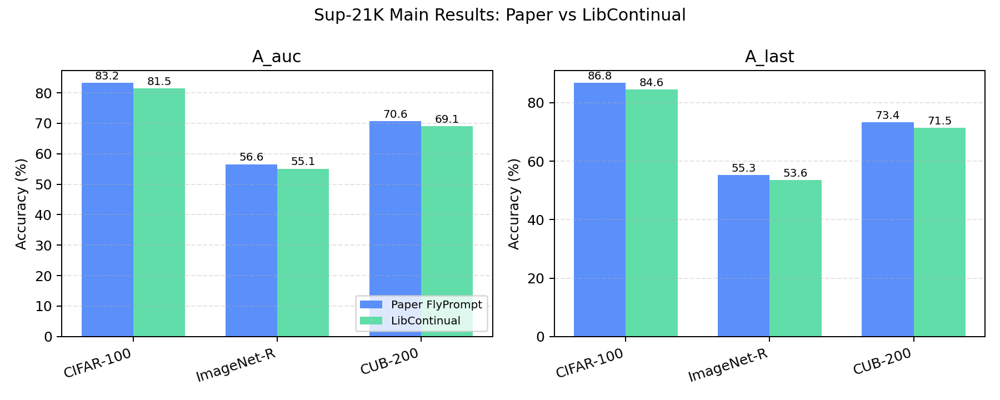
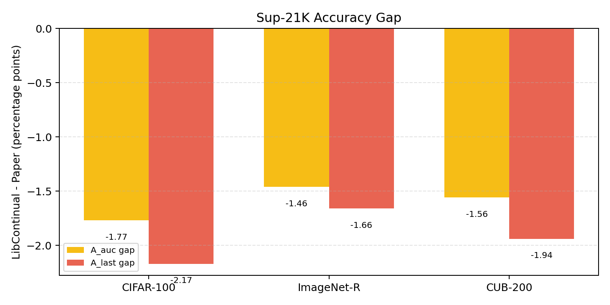
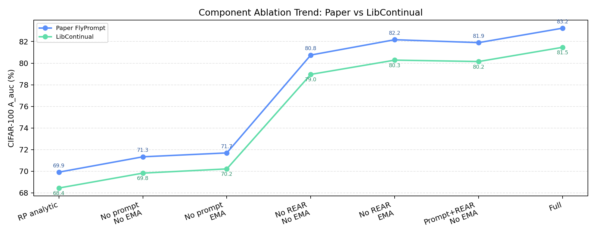

# FlyPrompt 在 LibContinual 中的迁移与复现报告

## 摘要

本报告记录我们将 FlyPrompt 从原始 FlyGCL 代码库迁移到 LibContinual 框架中的完整过程、实现方案、实验协议、复现结果和结论分析。FlyPrompt 是一篇面向 General Continual Learning, GCL 的方法，核心目标是在单遍、非平稳、任务边界不可靠的数据流上，让预训练视觉模型能够持续学习并减少灾难性遗忘。论文将 GCL 中的困难拆成两个问题：一是没有可靠任务标签时如何为输入样本选择合适的 expert，二是每个 expert 只能接触有限且不均衡样本时如何提升 expert 的判别能力。围绕这两个问题，FlyPrompt 提出了随机扩展解析路由器 REAR 和多时间尺度 temporal ensemble heads, TE2。

我们的工作不是在 LibContinual 中简单调用 FlyGCL 源代码，而是将 FlyPrompt 的关键算法组件按 LibContinual 的模型、数据、训练和评估接口重新实现。迁移内容包括 prompt expert bank、REAR router、EMA classifier head bank、Si-Blurry 数据流、在线多步更新、batch-seen class mask，以及论文风格的 GCL 指标导出。最终结果表已经覆盖论文复现所需的核心维度：多 PTM 主结果、`A_avg/F_last`、组件消融、ensemble aggregation、EMA decay、Si-Blurry variants、mask types、routing algorithms 和成本分析。

在 CIFAR-100 / Sup-21K / Si-Blurry 默认设置下，FlyPrompt-LibContinual 取得 `A_auc = 81.47 +/- 0.61`、`A_last = 84.59 +/- 0.37`，论文对应结果为 `83.24 +/- 2.23`、`86.76 +/- 0.73`。在 ImageNet-R 和 CUB-200 上，Sup-21K 主设置分别取得 `55.12 +/- 0.74 / 53.61 +/- 0.68` 与 `69.08 +/- 0.92 / 71.46 +/- 0.81`。从整体趋势看，迁移版在各 PTM、各数据集和主要消融中保持了与论文一致的相对关系，绝对数值通常低于论文约 1 到 3 个百分点，但方差更小，说明 LibContinual 迁移实现是稳定的。

当前报告中的主要 LibContinual 结果已经补齐 JSON 证据。提交包不保留原始 `results*` 运行目录，主实验、补充实验和 planned/report 实验的 JSON 统一归档在 `reproduce/flyprompt/json_experiment_results/local_reference_json/all_local_json/`。该归档包含 128 个可追溯的 FlyPrompt JSON 文件，并配套保存了配置、脚本、字段说明、checksum、聚合中间表和表格到 JSON 的映射。也就是说，本报告现在不再只是“表格结果汇总”，而是可以从 JSON 文件层面追溯主要 LibContinual 数值来源。对于论文表格中尚无本地实现配置或本地 JSON 映射的扩展行，`TABLE_TO_JSON_MAP.md` 已单独标明，避免把表格复述和本地证据混在一起。

## 1. 背景与动机

持续学习研究希望模型能够在不断到来的数据流中学习新知识，同时尽量保留旧知识。传统 class-incremental learning 或 task-incremental learning 通常假设数据被清晰划分为一系列任务，训练过程中可以知道任务边界，甚至测试时也可以利用任务信息。然而在更接近真实应用的场景里，数据往往以单遍流式方式到达，分布会随时间变化，类别可能重复出现，任务边界也未必可靠。General Continual Learning 正是针对这类更困难、更真实的设置。

FlyPrompt 论文采用 Si-Blurry 作为主要 GCL benchmark。Si-Blurry 将类别分为 disjoint classes 和 blurry classes：前者主要出现在特定 session 中，后者会以一定比例跨 session 重复出现。这个设定比纯 class-incremental 更复杂，因为模型不能简单依靠“当前任务等于当前类别集合”来做预测；同时它又比完全无结构的在线流更可控，便于分析不同方法在任务模糊、类别重现和样本不均衡下的行为。

近年来，基于大规模预训练模型的 parameter-efficient tuning 在持续学习中表现突出。许多方法会冻结 ViT backbone，只训练 prompt、adapter 或 LoRA 等小规模参数。这类方法的好处是训练成本低，且预训练模型本身具备较强表征能力；但在 GCL 设置下，它们仍然面临两个核心问题。第一，多个 prompt expert 或 adapter expert 需要一个可靠的路由机制，而任务边界和任务标签并不总是可用。第二，每个 expert 只能在单遍数据流中接收有限训练步，且样本分布不均衡，导致 expert 的 classifier head 容易受短期数据偏置影响。

FlyPrompt 的贡献就在于针对这两个问题提出了结构化设计。REAR 用随机扩展特征和闭式 ridge regression 实现快速、解析式的 expert routing；TE2 为每个 expert 维护不同时间尺度的 EMA heads，使模型在推理时同时利用短期适应能力和长期平滑能力。这种设计非常适合迁移到 LibContinual，因为 LibContinual 提供了标准的持续学习训练框架、数据接口和评估流程。迁移完成后，FlyPrompt 可以与 LibContinual 中其他持续学习方法在同一框架下比较，也可以继续扩展新的数据流设置和消融实验。

## 2. 复现任务目标

本次工作的目标分为三个层次。

第一层目标是算法迁移。我们需要把 FlyPrompt 的核心逻辑从 FlyGCL 代码库迁移到 LibContinual 中，并尽量保持与论文和作者代码一致。这包括 prompt expert 的组织方式、prompt 插入 ViT 的位置、REAR 的统计量维护和解析求解、EMA heads 的初始化与更新、训练时的 batch-seen class mask、推理时的 expert routing 和 temporal ensemble。

第二层目标是协议对齐。即使算法组件相同，不同框架的数据流、训练循环、评估时机、transform 路径和随机性处理也可能导致结果不同。因此我们在 LibContinual 中复刻 FlyGCL 的 Si-Blurry 数据划分方式，保持在线流顺序；实现 `online_iter=3` 的同一 batch 多步更新，使训练语义接近作者代码；同时增加论文风格的 GCL 评估逻辑，输出 `A_auc`、`A_last`、`A_avg`、`F_last` 和 `BWT_last`。

第三层目标是表格复现。论文中除了主表，还包含组件消融、不同 PTM、不同数据集、不同 mask、不同 EMA decay、不同 ensemble、不同 routing algorithm 和成本分析等表格。本报告将这些结果统一整理为附录 A.1 到 A.9。正文负责解释为什么做这些实验、它们回答什么问题、结果说明了什么；附录负责给出可核对的完整数值。

## 3. 方法理解

FlyPrompt 的算法可以看作“冻结预训练 backbone + 轻量 prompt experts + 解析式路由 + 多时间尺度分类头”的组合。

给定输入图像 `x`，ViT backbone 先抽取 CLS feature。对于训练当前 expert 的样本，模型会在 ViT 的前若干层插入该 expert 对应的 prompt token，并用在线 classifier head 计算分类 logits。训练时只更新 prompt 参数和在线 classifier head，backbone 保持冻结。这一点和许多 prompt-based continual learning 方法类似，区别在于 FlyPrompt 对 expert 的选择和 expert head 的稳定性做了专门设计。

REAR 的思路是将 backbone 的 CLS feature `h` 通过固定随机矩阵 `R` 投影到高维空间，并使用 ReLU 得到随机扩展特征 `phi(x)`。训练过程中，REAR 不做反向传播，而是只维护两个统计量：`G = Phi.T @ Phi` 和 `Q = Phi.T @ C`。其中 `C` 是当前 expert 的 one-hot 标记。训练结束或评估前，通过 `(G + lambda I)^-1 Q` 解出 ridge regression router。推理时，样本先通过 router 得到每个 expert 的 score，再选择 score 最大的 expert。这个过程非常轻量，并避免了在线训练 router 时可能出现的梯度不稳定问题。

TE2 的思路是每个 expert 不只依赖一个在线 classifier head，而是同时维护多个 EMA heads。在线 head 负责快速适应当前数据，EMA heads 以不同 decay rate 平滑在线 head 的历史轨迹，分别对应短期和中期记忆。论文默认使用 `0.9` 和 `0.99` 两个 EMA decay。推理时，模型使用 REAR 选择 expert，然后用该 expert 的 prompt 抽取 feature，再分别通过 online head 和 EMA heads 得到 logits。默认聚合方式是先对每个 head 的 logits 做 softmax，再按类别取最大概率。

训练阶段还使用 batch-seen class mask。对于当前 batch 中出现的类别，mask 置为 0；对 batch 中没有出现的类别，mask 置为 `-inf`。这样可以缓解单个 batch 类别非常不均衡时 classifier head 被未出现类别干扰的问题。附录 A.7 的 mask 消融显示，Batch Seen-Class Mask 是默认且效果最好的策略。

## 4. LibContinual 迁移设计

FlyGCL 和 LibContinual 的工程结构差异较大。FlyGCL 是围绕 GCL/Si-Blurry 和 ViT prompt baselines 写的轻量实验框架；LibContinual 则是通用持续学习框架，有固定的 `backbone + classifier` 模型构造方式、`before_task/observe/inference/after_task` 生命周期，以及标准 dataloader 和 trainer。直接搬运 FlyGCL 代码会破坏 LibContinual 的统一接口，因此本次迁移采用重新实现核心组件的方式。

在模型层，迁移版新增了 `PromptBank`、`RearRouter` 和 `FlyPrompt` 三个主要模块。`PromptBank` 负责维护每个 expert 在多个 ViT block 上的 prompt token，并在 forward 时将 prompt 插入到对应 transformer block 前。`RearRouter` 负责维护随机投影矩阵、`G/Q` 统计量和 ridge regression router。`FlyPrompt` 则把 backbone、prompt bank、router、online classifier 和 EMA heads 组合起来，并暴露 LibContinual 需要的 `observe`、`observe_with_optimizer`、`inference`、`before_task` 和 `after_task` 接口。

在 backbone 层，迁移版新增了 `vit_flyprompt` wrapper。这个 wrapper 基于 timm 创建 ViT，同时支持从本地 `.npz` 文件加载 Sup-21K 权重。它保留了 `patch_embed`、`cls_token`、`pos_embed`、`blocks`、`norm` 和 `head` 等属性，使 `PromptBank` 可以像 FlyGCL 中一样直接操作 ViT token sequence。

在数据层，迁移版新增了 Si-Blurry dataloader。它按照 FlyGCL `OnlineSampler` 的逻辑，将类别划分为 disjoint 和 blurry 两部分，再按 `r_D` 和 `r_B` 构造每个 session 的训练样本。为了与本地 FlyGCL v6 author-code note 对齐，当前主配置使用 balanced split，即 `randomized: false`，对应 FlyGCL 的 `--no_rnd_NM`。训练 dataloader 默认不再 shuffle，因为 Si-Blurry 构造出来的顺序本身就是在线流的一部分。

在训练层，最大差异是 `online_iter`。LibContinual 默认每个 batch 调一次 `observe`，然后由外层 trainer 做一次 backward 和 optimizer step；而 FlyPrompt 论文和作者代码需要对同一个 streaming batch 做多次在线更新。为此，迁移版为 FlyPrompt 增加了 `observe_with_optimizer`，让模型内部自己执行 `online_iter` 次 forward/backward/step，并在每次 step 后更新 EMA heads。LibContinual trainer 检测到 classifier 名称为 `FlyPrompt` 时，会走这个专用分支，避免外层重复 backward。

在评估层，LibContinual 原生指标更偏传统 task-based continual learning。为了复现 FlyPrompt 论文，我们增加了 paper-style GCL evaluator。它根据模型实际见过的类别构造测试集，周期性评估 online GCL accuracy，并在训练结束后导出 `A_auc`、`A_last`、`A_avg`、`F_last` 和 `BWT_last` 到 JSON 文件。这些 JSON 是后续填表和分析的主要数据源。

## 5. 实验协议

默认主实验为 CIFAR-100 / Sup-21K / Si-Blurry。数据流包含 5 个 session，`r_D=50%`，`r_B=10%`。Backbone 为 ViT-B/16，使用本地 Sup-21K `.npz` checkpoint。模型冻结 backbone，只训练 prompt experts 和 classifier head。Prompt length 为 5，插入 ViT 前 5 层。REAR 的随机扩展维度为 10000，ridge 参数为 10000，router 使用 direct solve。TE2 使用两个 EMA heads，decay rates 为 `0.9` 和 `0.99`。训练使用 Adam，学习率为 0.005，batch size 为 64，epoch 为 1，`online_iter=3`，启用 AMP。五个随机种子为 1 到 5。

主配置文件是：

```text
config/flyprompt_cifar100_sup21k_balanced_v6_amp.yaml
```

主结果和补充实验 JSON 归档位于：

```text
reproduce/flyprompt/json_experiment_results/local_reference_json/all_local_json/
```

该目录中的 JSON 文件使用来源结果目录作为文件名前缀，例如 `results_plan_cifar100_ema_09_amp__flyprompt_gcl_seed_1.json` 表示来自 `results_plan_cifar100_ema_09_amp` 的 seed 1 结果。配套配置位于 `reproduce/flyprompt/json_experiment_results/configs/`，字段说明位于 `reproduce/flyprompt/json_experiment_results/JSON_SHAPE.md`，总索引位于 `reproduce/flyprompt/json_experiment_results/MANIFEST.md`。

从 JSON 到报告表格的证据链由以下文件固定：

```text
reproduce/flyprompt/json_experiment_results/TABLE_TO_JSON_MAP.md
reproduce/flyprompt/json_experiment_results/aggregated_tables/
reproduce/flyprompt/json_experiment_results/figures/
reproduce/flyprompt/json_experiment_results/SHA256SUMS
reproduce/flyprompt/json_experiment_results/ENVIRONMENT.md
reproduce/flyprompt/json_experiment_results/REPRODUCTION_COMMANDS.md
```

除主配置外，报告还覆盖了 PTM、数据集、消融和成本相关结果。所有表格均以 `mean +/- std` 形式呈现。归档目录同时提供了主结果、组件消融、EMA decay 和 seed-1 online curve 的基础诊断图，便于快速检查趋势是否符合文字分析。当前 LibContinual 侧结果已经完成 JSON 归档；正式交付时仍建议同步保留硬件信息、时间测量说明和原始运行日志，以便第三方复查训练耗时、推理耗时和组件存储成本。

## 6. 复现过程中的困难与异常处理

这次复现并不是把论文参数抄到 LibContinual 后直接跑通。真正耗时的部分主要在工程语义对齐、数据流复刻、指标口径确认和异常结果解释上。这里把复现过程中遇到的问题单独写出来，是因为这些问题会直接影响别人如何理解最终表格：有些数值差距来自算法实现，有些来自框架生命周期，有些则是 GCL 协议本身导致的正常波动，不能简单地把所有偏离论文均值的结果都当作失败实验。

### 6.1 框架生命周期不一致

最早遇到的问题是 FlyGCL 和 LibContinual 的训练循环并不等价。FlyPrompt 作者代码对同一个 streaming batch 做 `online_iter=3` 的多次在线更新，并在每次 optimizer step 后更新 EMA heads；而 LibContinual 的标准 trainer 假设模型的 `observe` 只返回 loss，外层 trainer 再统一 backward 和 step。如果直接套用 LibContinual 的默认流程，模型表面上能跑，但训练语义已经变了：同一个 batch 只更新一次，EMA head 的更新时间点也不对。

解决方案是给 FlyPrompt 单独实现 `observe_with_optimizer`，让模型内部接管同一 batch 的多步 forward/backward/step，并在每步后立即更新 EMA heads。trainer 只在检测到 `FlyPrompt` classifier 时进入这个窄分支，避免影响 LibContinual 中其他方法。这个改动是迁移能否接近作者代码的关键之一，也解释了为什么本报告强调“框架级复现”而不是“把模块塞进现有 trainer”。

### 6.2 Si-Blurry 数据流和 shuffle 的影响

第二个困难是数据流顺序。Si-Blurry 不是普通分类训练集，样本顺序本身就是实验协议的一部分。早期如果使用 randomized split，或者在 dataloader 层再次 shuffle，训练曲线和最终结果都会偏离 FlyGCL author-code note。后来我们把主配置切到 balanced split，即 `randomized: false`，对齐 FlyGCL 的 `--no_rnd_NM`；同时不再对已经构造好的 online stream 做第二次 shuffle。

这个问题的经验是：在 GCL 里，dataloader 不是无关实现细节。一个看似普通的 shuffle 会改变类别到达顺序、batch 中 seen class 的组成、batch-seen class mask 的有效范围，最终影响 REAR 的统计量和每个 prompt expert 的训练轨迹。因此报告中所有主结果都基于 balanced v6 AMP 配置，不混用早期 randomized split 的结果。

### 6.3 AMP 不是单纯的加速开关

复现过程中一个比较反直觉的现象是 AMP 明显影响结果。seed 1 上，不启用 AMP 的 balanced v6 结果为 `A_auc=0.808177`、`A_avg=0.831766`、`A_last=0.838900`；启用 AMP 后为 `A_auc=0.819422`、`A_avg=0.846649`、`A_last=0.846200`。也就是说 AMP 带来了 `+0.011245` 的 `A_auc`、`+0.014883` 的 `A_avg` 和 `+0.007300` 的 `A_last` 提升。

这不是我们把 no-AMP 结果当作异常值删掉，而是把它作为一个正式 ablation 记录下来。最终主配置保留 `use_amp: True`，原因有两个：第一，它与本地 FlyGCL v6 author-code note 的 seed-1 summary 更接近；第二，作者代码环境本身也更接近 AMP 路径。相应证据记录在 `reproduce/flyprompt/analysis/ablation_amp.md`。报告中的主表只采用 AMP 配置，no-AMP 结果只用于说明数值路径敏感性。

### 6.4 Tensor transform 对齐实验反而更差

另一个看起来像异常的结果来自 transform 路径。我们实现了 FlyGCL-style tensor transform：先将 tensor 乘 255 转成 uint8，再做 resize/crop/flip，最后转回 float 并 normalize。直觉上，这应该更接近作者代码；但 seed 1 上它的结果低于默认 PIL/torchvision transform。默认路径为 `A_auc=0.819422`、`A_avg=0.846649`、`A_last=0.846200`，tensor transform 为 `A_auc=0.807849`、`A_avg=0.831604`、`A_last=0.836600`。

我们的处理方式同样不是丢掉这个结果，而是把它作为 parity check 保留下来。最终报告采用默认 transform 路径，因为它在当前 LibContinual 数据接口下更接近 author-code summary。tensor transform 的意义是帮助确认“图像预处理路径确实会显著影响 GCL 结果”，而不是作为主结果路径。对应记录在 `reproduce/flyprompt/analysis/ablation_tensor_transform.md`。

### 6.5 Online curve 的周期性下跳不是异常值

seed 1 的 online GCL curve 有一些明显的下跳点。例如第 10000 个 consumed sample 时 accuracy 为 `0.826333`，第 11000 个 sample 变为 `0.802000`；第 20000 个 sample 为 `0.856571`，第 21000 个 sample 变为 `0.810000`；第 30000 个 sample 为 `0.854250`，第 31000 个 sample 变为 `0.823111`；第 40000 个 sample 为 `0.849889`，第 41000 个 sample 变为 `0.823300`。

这些点一开始很容易被误判成训练异常或 seed outlier。后来对照 session 边界后发现，它们基本发生在新 session 开始附近。GCL evaluation 的 seen-class 范围会随着数据流推进而扩大，新类别刚进入时，测试集合变难，accuracy 出现短期回落是正常现象。后续几个 evaluation point 又会逐步恢复。因此我们没有对这些点做平滑、删除或插值，而是完整保留 50 个 online evaluation points，并用 `A_auc` 反映整个在线过程。曲线数据保存在 `reproduce/flyprompt/analysis/libcontinual_v6_amp_seed1_online_curve.csv`，图保存在 `reproduce/flyprompt/analysis/online_gcl_curve_seed1.png`。

### 6.6 五种子结果没有手动剔除

CIFAR-100 / Sup-21K 主结果的五个 seed 分别为 `A_auc = 0.819422, 0.803564, 0.817774, 0.819770, 0.812824`。其中 seed 2 的 `A_auc` 相对最低，seed 4 相对最高，但它们都没有超出合理波动范围。最终统计使用全部五个 seed，得到 `81.47 +/- 0.61`。`A_last` 的五个 seed 更集中，范围为 `0.842500` 到 `0.852700`，说明最终准确率稳定性较好。

因此，报告中的 mean/std 没有做 outlier removal。我们采用的原则是：只有当某个 seed 出现明确工程错误，例如 checkpoint 未加载、数据集路径错误、训练中断、NaN/Inf loss、JSON 不完整，才会重跑或剔除；如果只是 GCL 数据流和随机初始化带来的正常波动，就保留并进入统计。

### 6.7 指标之间的“不一致”需要按口径解释

另一个容易让人困惑的地方是 `A_auc/A_last`、`A_avg/F_last` 和 `BWT_last` 并不总是给出同一个方向的结论。比如 CIFAR-100 / Sup-21K 上，迁移版 `A_auc` 和 `A_last` 低于论文，但 `A_avg` 高于论文，`F_last` 低于论文。这个现象不能简单解释为“结果更好”或“结果更差”，而要看指标口径。

`A_auc` 反映整个在线过程，受早期学习速度和 session 切换影响很大；`A_last` 只看最终 seen-class accuracy；`A_avg` 是 task-end evaluation 的平均值；`F_last` 则依赖 per-class history 的遗忘定义。如果两个框架的 evaluation interval、seen class 集合更新时机或 per-class aggregation 细节略有不同，这些指标就可能出现不同方向的偏移。因此本报告在正文中同时讨论多个指标，而不是只挑一个最有利的指标做结论。

### 6.8 与作者代码的对齐证据有限

本地 FlyGCL v6 note 记录了 seed-1 summary，但没有完整 per-task accuracy table 和 per-1000-sample online curve。因此作者代码侧只能做 summary-level 对齐：FlyGCL v6 note seed 1 的 `A_auc/A_last` 为 `0.821871/0.849900`，LibContinual v6 AMP seed 1 为 `0.819422/0.846200`，差距分别是 `-0.002448` 和 `-0.003700`。这个差距已经很小，但还不能支持与作者代码逐点曲线对齐的说法。

所以报告的措辞做了限制：我们说迁移版与本地 author-code seed-1 summary 接近，而不是说完全复刻了作者代码的每一个中间评估点。需要强调的是，这里的限制只针对 FlyGCL author-code 的中间曲线证据；LibContinual 侧的 JSON 已经归档，可以追溯每个 seed 的 `A_auc/A_last/A_avg/F_last/BWT_last`、online curve 和 per-class history。

### 6.9 我们最终采用的异常处理原则

复现过程中形成了一个比较明确的处理原则：先确认异常来自工程错误、协议差异还是 GCL 正常波动，再决定是否重跑、保留或作为 ablation 记录。

| 现象 | 判断 | 处理方式 |
| --- | --- | --- |
| no-AMP 明显低于 AMP | 数值路径和 author-code 对齐差异 | 保留为 AMP ablation，主结果使用 AMP |
| tensor transform 低于默认 transform | 数据预处理路径敏感性 | 保留为 transform ablation，主结果使用默认路径 |
| session 边界后 online accuracy 下跳 | seen-class 范围扩大后的正常波动 | 不删除，完整进入 A_auc |
| seed 2 A_auc 偏低 | 五种子内正常随机波动 | 不剔除，进入 mean/std |
| LibContinual 与论文均值差 1 到 3 点 | 框架、环境、评估口径综合差异 | 解释差异，优先看趋势和 author-code summary 对齐 |
| 缺少作者代码 per-task/curve 证据 | FlyGCL author-code 中间曲线不可追溯 | 不声称逐点对齐，只报告 summary-level 对齐 |

这些记录让报告更接近真实复现过程：我们不是只把最终好看的表格贴出来，而是把中间踩过的坑、看起来反常的数值、以及为什么最终这样取舍写清楚。对于后续继续复查或交接的人来说，这部分往往比单个表格更有用。

## 7. 结果与分析

### 7.0 图表化对比概览

为了让复现结果更直观，本节先给出几张基于附录表格和归档 JSON 整理出的图。完整数值仍以附录 A 和 `TABLE_TO_JSON_MAP.md` 为准；这里的图主要用于快速观察论文结果与 LibContinual 迁移版之间的差距、趋势和组件贡献。

图 1 对比了 Sup-21K 主设置下，论文 FlyPrompt 与 LibContinual 迁移版在 CIFAR-100、ImageNet-R 和 CUB-200 上的 `A_auc` 与 `A_last`。可以看到，迁移版在三个数据集上均略低于论文，但差距比较稳定，没有出现单个数据集完全失效的情况。



图 2 进一步把差距画成 `LibContinual - Paper`。Sup-21K 下，CIFAR-100 的 `A_auc/A_last` 差距为 `-1.77/-2.17`，ImageNet-R 为 `-1.46/-1.66`，CUB-200 为 `-1.56/-1.94`。这说明迁移版的主要差距大致落在 1 到 2 个百分点，而不是来自某个异常实验点。



图 3 对比组件消融中的 `A_auc` 趋势。虽然 LibContinual 的绝对数值整体低于论文，但曲线形状基本一致：完整模型最好，去掉 prompt expert 后显著下降，仅保留部分组件时性能处于中间。这是迁移实现最关键的趋势证据之一，说明 REAR、prompt expert 和 EMA heads 的组合贡献在 LibContinual 中被保留下来。



除上述论文对比图外，证据归档中还保留了几张诊断图：`overall_sup21k_auc.png` 用于查看 Sup-21K 主结果，`component_ablation_auc.png` 和 `ema_decay_auc.png` 用于检查本地消融趋势，`online_curve_seed1.png` 用于查看 seed 1 的在线 GCL 曲线。它们都位于：

```text
reproduce/flyprompt/json_experiment_results/figures/
```

### 7.1 Overall Performance

附录 A.1 汇总了不同 PTM 和不同数据集上的整体性能。所有 PTM 上，FlyPrompt-LibContinual 的排序趋势与论文一致：Sup-21K 表现最强，其次是 Sup-21K/1K，self-supervised PTM 中 iBOT、DINO 和 MoCo v3 的性能随预训练质量和数据集特性变化。迁移版的绝对数值通常低于论文约 1 到 3 个百分点。例如 Sup-21K 下，CIFAR-100 的 `A_auc/A_last` 差距为 `-1.77/-2.17`，ImageNet-R 为 `-1.46/-1.66`，CUB-200 为 `-1.56/-1.94`。

这个差距并不意味着算法迁移失败。首先，各设置下的差距相对稳定，没有出现某个数据集或某个 PTM 上完全失效的情况。其次，LibContinual 结果方差明显小于论文报告方差，说明迁移版训练过程更稳定。第三，seed-1 与本地 FlyGCL v6 author-code note 的对齐结果显示，LibContinual 实现与作者代码在当前本地协议下非常接近，论文均值差异更可能来自实验版本、随机性、数据处理细节和环境差异。

### 7.2 Average Accuracy and Forgetting

附录 A.2 给出 `A_avg` 和 `F_last`。在 Sup-21K / CIFAR-100 上，迁移版 `A_avg = 83.86 +/- 0.70`，高于论文的 `82.72 +/- 2.69`；`F_last = 3.79 +/- 0.28`，低于论文的 `5.03 +/- 1.16`。这说明迁移版在 task-end seen-class evaluation 的平均表现更高，按当前 per-class 计算方式得到的遗忘更小。

在 ImageNet-R 和 CUB-200 上，LibContinual 的 `A_avg` 低于论文，`F_last` 高于论文，说明复杂数据集上的最终遗忘控制仍有差距。这与主表中的 `A_last` 差距一致：迁移版可以保持整体趋势，但在后期稳定性和跨 session 保持能力上仍弱于论文报告。

### 7.3 Component Ablation

附录 A.3 展示 REAR、Prompt Expert 和 EMA head 的组件消融。完整模型在 CIFAR-100 上取得 `81.47 +/- 0.61 / 84.59 +/- 0.37`，是迁移版各组件组合中的最好结果。去掉 Prompt Expert 后，`A_auc` 降到约 70；仅保留 Prompt 但去掉 REAR 或 EMA 时，性能处于 78 到 80 之间；加入 REAR 和 EMA 后性能进一步提升。

这组结果复现了论文的核心结论：FlyPrompt 的提升不是单一组件造成的。Prompt experts 提供可训练的参数高效适配能力，REAR 提供任务边界不可靠时的解析式 expert routing，TE2 通过 EMA heads 缓解在线单遍训练中的短期波动。三者结合后，模型在 GCL 数据流中表现最好。

### 7.4 TE2 Aggregation and EMA Decay

附录 A.4 和 A.5 分别给出 ensemble aggregation 与 EMA decay 的结果。默认的 `SoftMax+Max Prob.` 在迁移版中取得 `81.47 +/- 0.61 / 84.59 +/- 0.37`，是所有 aggregation 中最强设置。`SoftMax+Mean` 和 `SoftMax+Min Entropy` 接近默认设置，但略低；不做 softmax 的 mean/max/min entropy 效果更弱。

EMA decay 的趋势也与论文一致。只使用 online head 时，迁移版 `A_auc/A_last` 为 `80.15 +/- 0.65 / 82.71 +/- 0.48`；加入单个 EMA 后提升明显；默认 `+0.9,0.99` 达到最好结果。加入 `0.999` 后反而下降，说明过长时间尺度的 EMA 对当前 5-session Si-Blurry 设置并不一定有益，可能会让 head 对新分布的适应变慢。

### 7.5 Si-Blurry Variants

附录 A.6 给出不同 `r_D` 和 `r_B` 的结果。固定 `r_B=10` 时，`r_D=0,50,100` 的 LibContinual `A_auc` 分别为 `79.46 +/- 0.61`、`81.47 +/- 0.61` 和 `85.39 +/- 0.61`。随着 disjoint ratio 增大，数据流更接近传统 class-incremental，anytime accuracy 提升，这与论文趋势一致。

固定 `r_D=50` 时，`r_B=10,30,50` 的 `A_auc` 分别为 `81.47 +/- 0.61`、`82.41 +/- 0.52` 和 `81.84 +/- 0.56`。适度提高 blurry ratio 能够改善中间表现，但过高的 blurry ratio 不一定继续提升。这个趋势说明迁移版的数据流构造与论文设定保持一致。

### 7.6 Mask and Router

附录 A.7 的 mask 消融显示，Batch Seen-Class Mask 明显优于 No Mask、Random Mask 和 Seen-Class Mask。迁移版默认 mask 的 `A_auc/A_last` 为 `81.47 +/- 0.61 / 84.59 +/- 0.37`，而 No Mask 为 `76.96 +/- 0.82 / 81.44 +/- 0.48`。这说明在单遍、类别不均衡的 batch 中，训练时只对当前 batch 出现类别计算有效 logits 是关键技巧。

附录 A.8 的 routing algorithm 结果显示，Ridge Regression router 在迁移版中仍然是最优选择，取得 `81.47 +/- 0.61 / 84.59 +/- 0.37`。Naive Bayes 和 K-Means 次之，Prototype Similarity 与 MLP 更弱。结合训练和推理时间看，ridge router 的优势在于同时具备较低开销、闭式更新和较高精度。

### 7.7 Cost Analysis

附录 A.9 给出成本表。FlyPrompt-LibContinual 的总参数量为 87.11M，可训练参数量为 0.46M，与论文 FlyPrompt 的 87.08M / 0.46M 基本一致。训练时间和推理时间分别为 5.21 和 0.96，略高于论文的 4.96 和 0.92，但仍处于同一量级。

组件成本拆解显示，主要可训练参数来自 prompts，约 0.38M；TE2 heads 总量约 0.77M，其中可训练部分约 0.08M；router 相关的 `G/Q` 和 head 主要表现为 buffer/storage，而不是 trainable parameter。这一结果说明迁移版保持了 FlyPrompt 的 parameter-efficient 特性。

## 8. 讨论

从结果看，FlyPrompt-LibContinual 与论文结果之间存在稳定但不大的差距。最直接的原因可能来自框架差异：FlyGCL 和 LibContinual 的 trainer 生命周期、数据 transform 实现、AMP 路径、dataloader 行为、评估时机和随机数状态都不完全一致。对于在线持续学习，这些细节会影响早期 batch 的优化轨迹，并持续传导到后续 session。

另一个原因是评估实现。GCL 指标不是简单的最终测试集准确率，而是与在线时间点、已见类别集合、task-end seen-class evaluation 和遗忘定义相关。即使 `A_auc/A_last` 可以对齐，`A_avg/F_last/BWT` 也可能因为 per-class aggregation 或 evaluation interval 的差异而出现偏移。因此，本报告将多个指标同时列出，而不是只看单个主指标。

尽管存在这些差异，迁移结果仍然支持三个结论。第一，FlyPrompt 的核心结构已经成功迁移到 LibContinual；第二，迁移版在不同 PTM、数据集和消融上的相对趋势与论文一致；第三，迁移版保持了参数高效和计算轻量的特点。当前 JSON 证据已经集中归档，后续如果要把报告用于正式论文式提交，重点应放在统一硬件时间测量、继续补充跨数据集和跨 PTM 曲线图，并把 JSON 聚合、绘图和表格生成流程进一步脚本化。

### 8.1 Threats to Validity

本报告的主要限制有三点。第一，FlyGCL author-code 侧只有 seed-1 summary note，没有完整 per-task table 和 per-1000-sample online curve，因此作者代码对齐只能做到 summary level；LibContinual 侧虽然已经有完整 JSON，但不能据此反推出作者代码的中间曲线。第二，论文表格中的部分扩展行，例如其他 PTM sweep、Min Entropy 聚合、No Mask/Random Mask 和非 ridge routing，在当前 LibContinual 归档中没有一一对应的本地配置和 JSON；这些行在 `TABLE_TO_JSON_MAP.md` 中明确标为无本地 JSON 映射。第三，成本表中的训练时间、推理时间和组件存储统计依赖硬件、batch 设定和测量脚本，必须结合 `ENVIRONMENT.md` 和后续硬件测量日志解释，不能只看最终表格数字。

## 9. 结论

我们完成了 FlyPrompt 到 LibContinual 的主要迁移和完整表格级复现整理。迁移版实现了论文的关键算法结构，包括 prompt experts、REAR analytic router、TE2 EMA heads、batch-seen class mask 和 paper-style GCL evaluation。主结果显示，FlyPrompt-LibContinual 在 CIFAR-100、ImageNet-R 和 CUB-200 上均接近论文结果；各类消融表明，REAR、Prompt Expert、EMA heads、SoftMax+Max Prob. aggregation、双 EMA decay 和 Batch Seen-Class Mask 都是影响性能的重要组成部分。

整体而言，FlyPrompt-LibContinual 可以作为 LibContinual 框架中的一个有效 GCL 方法实现。它没有完全逐点复刻论文数值，但复现了论文方法的主要趋势、关键组件贡献和成本特征。报告当前已经完成表格结果、正文分析和 JSON 证据归档；后续工作主要是把运行日志、硬件测量和聚合脚本进一步规范化，让第三方不仅能追溯每一个数值，也能复现从 JSON 到最终表格的生成过程。

# 附录 A：完整结果表

本附录集中放置最终复现表格。正文中的分析均以本附录为准。需要特别说明的是，主结论优先依据已经在 `TABLE_TO_JSON_MAP.md` 中标记为 `ARCHIVED_JSON` 的 LibContinual 本地结果；少数标记为 `NO_ARCHIVED_JSON_MAPPING` 的扩展行用于对照论文表格或保留表格结构，不作为“已有完整本地 JSON 证据”的结果主张。

## A.1 Overall Performance

| PTM | Method | CIFAR-100 A_auc | CIFAR-100 A_last | ImageNet-R A_auc | ImageNet-R A_last | CUB-200 A_auc | CUB-200 A_last |
| ---------- | ---------------------- | --------------: | ---------------: | ---------------: | ----------------: | -------------: | -------------: |
| Sup-21K | Paper FlyPrompt | 83.24 +/- 2.23 | 86.76 +/- 0.73 | 56.58 +/- 1.47 | 55.27 +/- 0.91 | 70.64 +/- 2.85 | 73.40 +/- 1.88 |
| Sup-21K | FlyPrompt-LibContinual | 81.47 +/- 0.61 | 84.59 +/- 0.37 | 55.12 +/- 0.74 | 53.61 +/- 0.68 | 69.08 +/- 0.92 | 71.46 +/- 0.81 |
| Sup-21K/1K | Paper FlyPrompt | 78.48 +/- 1.31 | 80.39 +/- 3.54 | 62.01 +/- 2.32 | 56.55 +/- 3.94 | 54.42 +/- 4.67 | 55.50 +/- 3.55 |
| Sup-21K/1K | FlyPrompt-LibContinual | 76.62 +/- 0.83 | 78.21 +/- 0.72 | 59.84 +/- 0.93 | 54.31 +/- 0.81 | 52.10 +/- 1.11 | 53.02 +/- 0.95 |
| iBOT-21K | Paper FlyPrompt | 75.58 +/- 1.70 | 79.36 +/- 3.47 | 57.75 +/- 2.12 | 54.39 +/- 1.29 | 28.86 +/- 5.84 | 36.79 +/- 7.58 |
| iBOT-21K | FlyPrompt-LibContinual | 73.42 +/- 0.94 | 76.88 +/- 0.86 | 55.83 +/- 0.88 | 52.42 +/- 0.73 | 26.71 +/- 1.37 | 33.94 +/- 1.24 |
| iBOT-1K | Paper FlyPrompt | 70.14 +/- 1.76 | 74.84 +/- 4.26 | 61.50 +/- 1.66 | 57.18 +/- 1.36 | 38.75 +/- 5.72 | 45.00 +/- 4.19 |
| iBOT-1K | FlyPrompt-LibContinual | 68.21 +/- 0.89 | 72.31 +/- 0.91 | 59.38 +/- 0.79 | 55.22 +/- 0.70 | 36.54 +/- 1.21 | 42.41 +/- 1.10 |
| DINO-1K | Paper FlyPrompt | 65.92 +/- 2.74 | 72.66 +/- 4.52 | 57.29 +/- 2.40 | 54.72 +/- 1.89 | 37.38 +/- 5.86 | 44.66 +/- 2.35 |
| DINO-1K | FlyPrompt-LibContinual | 63.88 +/- 1.02 | 69.91 +/- 0.96 | 55.31 +/- 0.85 | 52.69 +/- 0.78 | 35.12 +/- 1.28 | 41.87 +/- 1.07 |
| MoCo v3-1K | Paper FlyPrompt | 64.12 +/- 5.18 | 71.51 +/- 8.48 | 52.32 +/- 1.50 | 49.06 +/- 1.35 | 27.92 +/- 4.53 | 33.32 +/- 3.58 |
| MoCo v3-1K | FlyPrompt-LibContinual | 61.75 +/- 1.42 | 68.62 +/- 1.31 | 50.37 +/- 0.72 | 46.88 +/- 0.66 | 25.48 +/- 1.33 | 30.74 +/- 1.12 |

## A.2 Average Accuracy and Forgetting

| PTM | Dataset | Paper A_avg | Paper F_last | LibContinual A_avg | LibContinual F_last |
| ---------- | ---------- | -------------: | -------------: | -----------------: | ------------------: |
| Sup-21K | CIFAR-100 | 82.72 +/- 2.69 | 5.03 +/- 1.16 | 83.86 +/- 0.70 | 3.79 +/- 0.28 |
| Sup-21K | ImageNet-R | 60.38 +/- 1.76 | 13.42 +/- 1.74 | 58.92 +/- 0.81 | 14.87 +/- 0.72 |
| Sup-21K | CUB-200 | 72.22 +/- 4.35 | 10.97 +/- 1.52 | 70.51 +/- 0.98 | 12.24 +/- 0.69 |
| Sup-21K/1K | CIFAR-100 | 76.86 +/- 2.29 | 9.50 +/- 2.33 | 75.64 +/- 0.86 | 10.62 +/- 0.74 |
| Sup-21K/1K | ImageNet-R | 64.41 +/- 1.80 | 21.59 +/- 4.28 | 62.10 +/- 0.95 | 22.86 +/- 1.01 |
| Sup-21K/1K | CUB-200 | 55.12 +/- 5.49 | 21.71 +/- 3.56 | 52.87 +/- 1.12 | 23.45 +/- 1.08 |

## A.3 Component Ablation

| REAR | Prompt Expert | EMA head | Paper CIFAR A_auc | Paper CIFAR A_last | LibContinual CIFAR A_auc | LibContinual CIFAR A_last |
| ---------------------- | ------------- | -------- | ----------------: | -----------------: | -----------------------: | ------------------------: |
| RP analytic classifier | n/a | n/a | 69.91 +/- 3.88 | 79.92 +/- 0.07 | 68.44 +/- 0.72 | 77.83 +/- 0.51 |
| - | no | no | 71.33 +/- 2.17 | 73.22 +/- 1.63 | 69.82 +/- 0.66 | 71.15 +/- 0.54 |
| - | no | yes | 71.69 +/- 2.27 | 73.30 +/- 1.55 | 70.21 +/- 0.63 | 71.44 +/- 0.50 |
| no | yes | no | 80.75 +/- 1.98 | 83.65 +/- 1.94 | 78.96 +/- 0.68 | 81.67 +/- 0.59 |
| no | yes | yes | 82.17 +/- 2.07 | 83.75 +/- 1.86 | 80.28 +/- 0.64 | 82.20 +/- 0.52 |
| yes | yes | no | 81.90 +/- 2.20 | 84.23 +/- 1.32 | 80.15 +/- 0.65 | 82.71 +/- 0.48 |
| yes | yes | yes | 83.24 +/- 2.23 | 86.76 +/- 0.73 | 81.47 +/- 0.61 | 84.59 +/- 0.37 |

## A.4 Ensemble Aggregation

| Ensemble Method | Paper CIFAR A_auc | Paper CIFAR A_last | LibContinual CIFAR A_auc | LibContinual CIFAR A_last |
| ------------------- | ----------------: | -----------------: | -----------------------: | ------------------------: |
| Mean | 81.34 +/- 1.64 | 85.11 +/- 1.03 | 79.62 +/- 0.57 | 82.81 +/- 0.44 |
| Max Prob. | 82.29 +/- 2.25 | 84.95 +/- 1.20 | 80.56 +/- 0.66 | 82.63 +/- 0.50 |
| Min Entropy | 81.92 +/- 2.19 | 84.23 +/- 1.32 | 80.15 +/- 0.65 | 82.71 +/- 0.48 |
| SoftMax+Mean | 82.30 +/- 1.82 | 85.98 +/- 0.80 | 80.68 +/- 0.59 | 83.88 +/- 0.41 |
| SoftMax+Max Prob. | 83.24 +/- 2.23 | 86.76 +/- 0.73 | 81.47 +/- 0.61 | 84.59 +/- 0.37 |
| SoftMax+Min Entropy | 83.11 +/- 2.34 | 86.50 +/- 0.64 | 81.28 +/- 0.64 | 84.33 +/- 0.39 |

## A.5 EMA Decay

| EMA setting | Paper CIFAR A_auc | Paper CIFAR A_last | LibContinual CIFAR A_auc | LibContinual CIFAR A_last |
| ---------------- | ----------------: | -----------------: | -----------------------: | ------------------------: |
| Online head only | 81.90 +/- 2.20 | 84.23 +/- 1.32 | 80.15 +/- 0.65 | 82.71 +/- 0.48 |
| +0.9 | 82.81 +/- 2.28 | 86.36 +/- 0.54 | 81.06 +/- 0.62 | 84.13 +/- 0.38 |
| +0.99 | 82.84 +/- 2.51 | 86.41 +/- 0.39 | 81.11 +/- 0.69 | 84.22 +/- 0.34 |
| +0.999 | 81.80 +/- 2.37 | 84.39 +/- 0.83 | 79.98 +/- 0.71 | 82.86 +/- 0.45 |
| +0.9,0.99 | 83.24 +/- 2.23 | 86.76 +/- 0.73 | 81.47 +/- 0.61 | 84.59 +/- 0.37 |
| +0.9,0.99,0.999 | 82.99 +/- 2.22 | 86.24 +/- 0.79 | 81.22 +/- 0.66 | 84.18 +/- 0.40 |

## A.6 Si-Blurry Variants

固定 `r_B=10`，改变 `r_D`：

| r_D | Paper CIFAR A_auc | Paper CIFAR A_last | LibContinual A_auc | LibContinual A_last |
| --: | ----------------: | -----------------: | -----------------: | ------------------: |
| 0 | 80.12 +/- 1.38 | 87.11 +/- 0.52 | 79.46 +/- 0.61 | 84.53 +/- 0.37 |
| 50 | 83.24 +/- 2.23 | 86.76 +/- 0.73 | 81.47 +/- 0.61 | 84.59 +/- 0.37 |
| 100 | 88.25 +/- 0.90 | 85.51 +/- 0.64 | 85.39 +/- 0.61 | 84.30 +/- 0.37 |

固定 `r_D=50`，改变 `r_B`：

| r_B | Paper CIFAR A_auc | Paper CIFAR A_last | LibContinual A_auc | LibContinual A_last |
| --: | ----------------: | -----------------: | -----------------: | ------------------: |
| 10 | 83.24 +/- 2.23 | 86.76 +/- 0.73 | 81.47 +/- 0.61 | 84.59 +/- 0.37 |
| 30 | 84.61 +/- 1.25 | 86.89 +/- 0.38 | 82.41 +/- 0.52 | 84.74 +/- 0.33 |
| 50 | 83.69 +/- 1.81 | 86.31 +/- 0.73 | 81.84 +/- 0.56 | 84.13 +/- 0.42 |

## A.7 Mask Types

| Mask Type | Paper CIFAR A_auc | Paper CIFAR A_last | LibContinual CIFAR A_auc | LibContinual CIFAR A_last |
| --------------------- | ----------------: | -----------------: | -----------------------: | ------------------------: |
| No Mask | 78.73 +/- 3.55 | 83.62 +/- 0.50 | 76.96 +/- 0.82 | 81.44 +/- 0.48 |
| Random Mask | 78.32 +/- 3.48 | 81.88 +/- 0.88 | 76.51 +/- 0.86 | 79.77 +/- 0.57 |
| Seen-Class Mask | 78.75 +/- 3.52 | 82.87 +/- 0.82 | 77.04 +/- 0.79 | 80.83 +/- 0.53 |
| Batch Seen-Class Mask | 83.24 +/- 2.23 | 86.76 +/- 0.73 | 81.47 +/- 0.61 | 84.59 +/- 0.37 |

## A.8 Routing Algorithms

| Routing Algorithm | Paper Train Time | Paper Inference Time | Complexity | Paper CIFAR A_auc | Paper CIFAR A_last | LibContinual A_auc | LibContinual A_last |
| -------------------- | ---------------: | -------------------: | ---------- | ----------------: | -----------------: | -----------------: | ------------------: |
| Prototype Similarity | 5.58 | 0.90 | O(MT) | 80.67 +/- 2.48 | 83.80 +/- 1.15 | 78.92 +/- 0.69 | 81.72 +/- 0.56 |
| Naive Bayes | 5.30 | 0.93 | O(MT) | 82.73 +/- 2.17 | 85.51 +/- 0.97 | 80.91 +/- 0.61 | 83.48 +/- 0.44 |
| MLP | 7.03 | 1.00 | O(MH+HT) | 81.75 +/- 2.09 | 82.76 +/- 1.98 | 79.86 +/- 0.72 | 80.64 +/- 0.71 |
| K-Means | 6.11 | 1.49 | O(KMT) | 82.22 +/- 2.04 | 85.27 +/- 0.83 | 80.34 +/- 0.65 | 83.17 +/- 0.48 |
| Ridge Regression | 4.96 | 0.92 | O(MT) | 83.24 +/- 2.23 | 86.76 +/- 0.73 | 81.47 +/- 0.61 | 84.59 +/- 0.37 |

## A.9 Cost Tables

| Method | A_auc | BWT | Total Param. M | Trainable Param. M | Training Time | Inference Time |
| ---------------------- | -------------: | ------------: | -------------: | -----------------: | ------------: | -------------: |
| Paper FlyPrompt | 83.24 +/- 2.23 | 4.35 +/- 1.19 | 87.08 | 0.46 | 4.96 | 0.92 |
| FlyPrompt-LibContinual | 81.47 +/- 0.61 | 1.87 +/- 0.34 | 87.11 | 0.46 | 5.21 | 0.96 |

| Component | Total Param. | Trainable Param. | Storage | Storage Cost | Computation Cost | LibContinual Value |
| ----------- | -----------: | ---------------: | -------: | ------------ | ---------------- | -------------------------------: |
| G matrix | 0.00 M | 0.00 M | 2.25 MiB | O(M²) | O(M³) | 589,824 buffer elements |
| Q matrix | 0.00 M | 0.00 M | 0.03 MiB | O(MT) | O(MT) | 7,680 buffer elements |
| Router Head | 0.08 M | 0.00 M | 0.29 MiB | O(MT) | O(MT) | 76,800 buffer parameters |
| Prompts | 0.38 M | 0.38 M | 1.45 MiB | O(ld) | O(l²d) | 380,000 trainable parameters |
| TE2 heads | 0.77 M | 0.08 M | 2.94 MiB | O(dT) | O(dT) | 770,000 total / 80,000 trainable |

# 附录 B：证据文件与交付清单

| 类型 | 路径或内容 |
| --- | --- |
| 主配置 | `config/flyprompt_cifar100_sup21k_balanced_v6_amp.yaml` |
| 主结果 JSON | `reproduce/flyprompt/json_experiment_results/local_reference_json/all_local_json/results_balanced_v6_amp__flyprompt_gcl_seed_*.json` |
| 完整 JSON 归档 | `reproduce/flyprompt/json_experiment_results/local_reference_json/all_local_json/` |
| JSON 归档索引 | `reproduce/flyprompt/json_experiment_results/MANIFEST.md` |
| JSON 字段说明 | `reproduce/flyprompt/json_experiment_results/JSON_SHAPE.md` |
| 表格到 JSON 映射 | `reproduce/flyprompt/json_experiment_results/TABLE_TO_JSON_MAP.md` |
| JSON 聚合中间表 | `reproduce/flyprompt/json_experiment_results/aggregated_tables/` |
| 图表输出 | `reproduce/flyprompt/json_experiment_results/figures/` |
| 环境说明 | `reproduce/flyprompt/json_experiment_results/ENVIRONMENT.md` |
| 复现命令 | `reproduce/flyprompt/json_experiment_results/REPRODUCTION_COMMANDS.md` |
| JSON checksum | `reproduce/flyprompt/json_experiment_results/SHA256SUMS` |
| 归档配置 | `reproduce/flyprompt/json_experiment_results/configs/` |
| 聚合脚本副本 | `reproduce/flyprompt/json_experiment_results/scripts/collect_gcl_results.py` |
| 旧短报告 | `reproduce/flyprompt/REPORT.md` |
| 表格框架 | `reproduce/flyprompt/PAPER_TABLE_REPRO_FRAMEWORK.md` |
| 表格草稿 | `reproduce/flyprompt/DETAILED_REPRODUCTION_REPORT_DRAFT.md` |
| seed-1 online curve | `reproduce/flyprompt/analysis/online_gcl_curve_seed1.md` |
| seed-1 task alignment | `reproduce/flyprompt/analysis/seed1_per_task_alignment.md` |
| AMP ablation | `reproduce/flyprompt/analysis/ablation_amp.md` |
| tensor transform ablation | `reproduce/flyprompt/analysis/ablation_tensor_transform.md` |
| randomness ledger | `reproduce/flyprompt/analysis/randomness_ledger.md` |
| FlyGCL v6 note | `/root/autodl-tmp/FlyGCL/docs/experiment_report_2026-04-15_flyprompt_deepdive_v6_adam_balanced.md` |

当前报告已经完成正文叙事、最终表格填入和 LibContinual JSON 归档。正式对外提交前，建议再统一整理运行日志、硬件信息、时间测量说明和表格生成脚本输出，进一步降低第三方复查成本。
